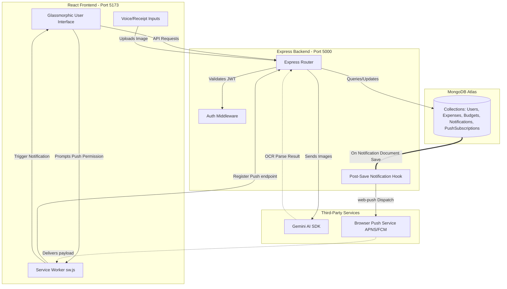

# 🪙 FinTrack AI — Modern Smart Expense Tracker

FinTrack AI is a next-generation personal finance manager equipped with AI-driven receipt scanning, dynamic budget calculations, debt planning, transaction exporting, and native web push notifications. Built using a modern TypeScript backend and a polished glassmorphic React frontend.

---

## ✨ Key Features

- **🤖 Multimodal AI Receipt Scanner**: Drop or upload receipt images. Analyzed via `gemini-2.5-flash` to extract merchant, total cost, items, and categorization with manual edit options and quota-limit fallback.
- **🖼️ Receipt Gallery**: Interactive dashboard displaying scanned receipts with full text-search, status filters (processed vs. fallback), and a glassmorphic overlay displaying OCR details and deletion capability.
- **🔔 Native Web Push Notifications**: Native desktop and mobile notifications delivered using the Web Push Protocol, powered by dynamic VAPID keys. Auto-notifies users when budgets are exceeded or billing events occur.
- **📊 Real-time Analytics & Dashboards**: Premium glassmorphic interface with interactive Recharts charts showing budget utilization, income, expenses, and debts.
- **📥 Client-side CSV/PDF Exporter**: Clean transaction exporting in spreadsheet-ready CSV format, and printer-optimized layout templates for printing physical reports.
- **⚡ Voice Expense Input**: Add transactions using interactive voice recognition.

---

## 🛠️ Technology Stack

### Frontend
- **Framework**: React 19 (via Vite)
- **Styling**: Tailwind CSS & Vanilla CSS (Curated HSL color systems, Glassmorphism, CSS Micro-animations)
- **State & Routing**: React Router DOM, Custom Contexts (AuthContext)
- **Data Visualizations**: Recharts
- **Icons**: Lucide React
- **Animations**: Framer Motion

### Backend
- **Runtime & Language**: Node.js, TypeScript (`tsx` compilation)
- **Framework**: Express
- **Database**: MongoDB (via Mongoose ODM)
- **Push Services**: Web-Push Protocol (VAPID key signatures)
- **AI Integrations**: Google Gemini API (`@google/genai` sdk, `gemini-2.5-flash` model)

---

## 📐 Architecture & Data Flow

Below is the high-level architecture diagram detailing the interaction between the client, backend server, database, and third-party integrations:



---

## ⚙️ Local Setup & Configuration

### Prerequisites
- Node.js (v18 or higher)
- npm or yarn
- MongoDB (Local server or MongoDB Atlas connection string)

### 1. Clone & Directory Structure
```bash
git clone https://github.com/Maruthi14-gif/FinTrack-AI.git
cd FinTrack-AI
```

### 2. Environment Variables Configuration

#### Backend Configuration (`backend/.env`)
Create a `.env` file in the `backend/` folder:
```env
PORT=5000
MONGO_URI=mongodb+srv://your-db-uri
JWT_SECRET=your_jwt_signature_secret
GEMINI_API_KEY=your_gemini_api_key

# Optional: If not provided, backend generates VAPID keys dynamically in-memory on start
VAPID_PUBLIC_KEY=your_public_vapid_key
VAPID_PRIVATE_KEY=your_private_vapid_key
```

#### Frontend Configuration (`frontend/.env`)
Create a `.env` file in the `frontend/` folder:
```env
VITE_API_URL=http://localhost:5000
```

### 3. Installation & Run

Open two terminal windows to run the servers in parallel:

#### Terminal 1 (Backend)
```bash
cd backend
npm install
npm run dev
```
- Server will listen on: `http://localhost:5000`
- Logs will show: `VAPID keys not configured. Generating dynamic keys...` or similar status.

#### Terminal 2 (Frontend)
```bash
cd frontend
npm install
npm run dev
```
- App will run on: `http://localhost:5173`

---

## 🚀 Deployment Instructions

### Production Build compilation
Before deploying, ensure that the project compiles with no warnings or type errors:

```bash
# In backend/
npm run build

# In frontend/
npm run build
```

### Backend Deployment (e.g., Render, Heroku)
1. Set the build command to: `cd backend && npm install && npm run build`
2. Set the start command to: `node backend/dist/server.js`
3. Configure environmental variables on your host platform matching your `backend/.env`.

### Frontend Deployment (e.g., Vercel, Netlify)
1. Point your host to the root of the repo.
2. Select target directory as `frontend`.
3. Set the build command to: `npm run build`
4. Set the output directory to: `dist`
5. Configure `VITE_API_URL` pointing to your hosted backend API URL.

---

## 🔔 How to Use Native Push Notifications

1. Open the application.
2. Click on the **Notification Bell** icon in the navigation bar.
3. Click the **"Enable Phone Notifications"** opt-in banner.
4. When prompted by your browser, click **Allow**.
5. To test notifications:
   - Go to **Budgets** and create a category budget (e.g., *Food*: $50).
   - Add a transaction that exceeds this budget limit.
   - You will receive a system-level slide-out browser notification natively on your device, even if the application tab is running in the background.
