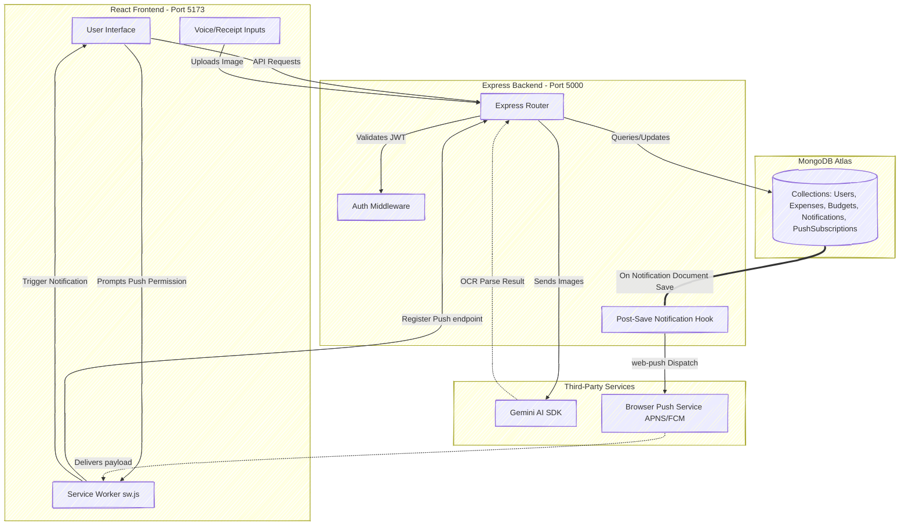

# FinTrack AI — Modern Smart Expense Tracker

FinTrack AI (also called **FinVoice** in the app) is a personal finance manager that listens. You can log an expense by simply *saying* "spent 250 on groceries" — in English, Hindi, or Telugu — and AI takes care of the amount, category, and date. Add receipt scanning, budgets with push alerts, a chat-based financial coach, and downloadable PDF/Excel reports, and you get a complete money companion built on a TypeScript backend and a React 19 frontend.

---

## Table of Contents

1. [Features](#features)
2. [How It Works](#how-it-works)
3. [How I Built It](#how-i-built-it)
4. [Project Structure](#project-structure)
5. [Technology Stack](#technology-stack)
6. [Local Setup & Configuration](#local-setup--configuration)
7. [Deployment Instructions](#deployment-instructions)
8. [How to Use Native Push Notifications](#how-to-use-native-push-notifications)

---

## Features

### Expense Entry — three ways
- **Voice input**: Speak naturally in **English, Hindi, or Telugu** ("Paid 1200 for petrol yesterday"). The Web Speech API transcribes it, Gemini extracts item, amount, category, and date — even multiple expenses in one sentence.
- **AI receipt scanner**: Upload or drop a receipt photo. `gemini-2.5-flash` vision reads the merchant, date, total, and every line item, each classified into a category. A **receipt gallery** keeps all scans searchable with processed/fallback status filters.
- **Quick text form**: Classic manual entry for when typing is faster.

### Smart Organization
- **AI category detection** into 9 categories: Food, Travel, Shopping, Bills, Education, Entertainment, Healthcare, Investments, Others.
- **Transaction history** with text search, category filter, date-range filter, amount range, sorting, and server-side pagination.
- **Natural language search**: Type "show petrol expenses above 500 last week" and the AI converts it into database filters automatically.

### Budgets & Alerts
- **Monthly budgets per category** with live progress on remaining budget.
- **Smart budget alerts**: A warning notification at 90% of a budget and an alert when it is exceeded — deduplicated so you get at most one per category per day.
- **Spending anomaly detection**: Every saved expense is compared with that category's 3-month average. A spike of 50%+ (and at least ₹500) raises an "Unusual Spending" alert.
- **Bill reminders**: Active subscriptions due within 3 days generate reminders automatically.
- **Native web push**: All alerts also arrive as system-level notifications on desktop/mobile via the Web Push Protocol (VAPID), even when the tab is in the background.

### AI Financial Assistant
- **Chat coach**: Ask "How much did I spend this month?", "What is my highest spending category?" — answers are grounded in *your* data, which is fetched and passed to Gemini as context.
- **AI spending insights**: Short actionable observations generated from your recent transactions, cached for an hour to save API quota.
- **Monthly AI summary**: Total spending, top categories, observations, savings suggestions, budget performance, and recommendations as a structured report.
- **Offline fallbacks everywhere**: If the Gemini key is missing or quota is exhausted, a local rule-based engine still parses voice text, answers common chat questions, and builds a programmatic monthly report — the app never breaks.

### Analytics & Reports
- **Dashboard**: Today / week / month / year / total spend cards, category distribution pie chart, 6-month bar chart, and 30-day trend line (Recharts).
- **Financial Health score**: A 0–100 score combining savings rate (40%), debt-to-income ratio (35%), and budget adherence (25%), with tailored recommendations.
- **PDF reports**: One-click branded PDF (header band, category breakdown with percentage shares, full transaction table, page numbers) via jsPDF + autotable.
- **Excel export**: Real `.xlsx` workbook with a Transactions sheet and a Summary sheet (SheetJS).
- **CSV export**: Spreadsheet-ready, with a UTF-8 BOM so Excel renders ₹ correctly.

### More Money Tools
- **Income tracker** with the same search/pagination engine as expenses.
- **Debt payoff planner**: Simulates **Snowball vs Avalanche** strategies month by month, showing time-to-debt-free and total interest for each, including extra-payment scenarios.
- **Subscription tracker** with billing cycles, pause/resume, and due-date reminders.

### Security & Sync
- **JWT authentication** with bcrypt password hashing and protected API routes.
- **Per-user data isolation**: Every query is scoped by the authenticated user's ID.
- **Cloud sync**: All data lives in MongoDB Atlas, so any device with a login sees the same state.

### Experience & Performance
- **Animated 3D landing page**: Mouse-tracking 3D dashboard mockup, floating gradient blobs, tilt-on-hover feature cards, count-up stats, and scroll-reveal sections — built with Framer Motion + CSS 3D transforms (no heavy 3D library).
- **Responsive everywhere**: Sidebar navigation on desktop, bottom tab bar on mobile.
- **Code-split routes**: Every page loads on demand (React.lazy); the heavy PDF/Excel libraries download only when you actually export. Main bundle: **985 kB → 418 kB**.

---

## How It Works

### The big picture



Every request follows the same path on the server: **route → controller → service → model**. Routes only wire URLs to controllers, controllers only handle the HTTP request/response, and services hold the actual business and AI logic.

### Flow 1: Adding an expense by voice

1. The browser's **Web Speech API** listens (language selectable: `en-IN`, `hi-IN`, `te-IN`) and produces a transcript.
2. The transcript goes to `POST /api/expenses/parse`.
3. `aiService.parseExpense()` sends Gemini a prompt with today's date and strict output rules: return a **JSON array** with `item`, `amount`, `category` (from the fixed list of 9), `date`, `description` — translated to English if spoken in Hindi/Telugu.
4. The response is cleaned (markdown fences stripped), parsed, and each category is normalized against the allowed list (e.g. "Transport" → "Travel").
5. Each expense is saved to MongoDB, then two checks fire in the background: **budget limit** and **spending anomaly**.
6. If Gemini is unavailable, a local regex/keyword parser extracts the amount, guesses the category from ~60 keywords, and handles "yesterday"-style dates — so voice entry works even offline.

### Flow 2: Scanning a receipt

1. The image is sent as base64 to `POST /api/ai/parse-receipt` and saved to disk under `backend/public/uploads/`.
2. `receiptService` sends the image bytes **inline to Gemini vision** with a JSON schema prompt: merchant, date, total, category, and per-line-item breakdown.
3. The parsed result is normalized, stored as a `Receipt` document (status `processed` or `failed`), and returned so the UI can pre-fill an editable expense form.
4. The Receipt Gallery lists all scans; deleting one also removes the image file from disk.

### Flow 3: Asking the AI coach a question

1. The chat UI posts your message to `POST /api/ai/chat`.
2. `chatService` fetches your last 150 expenses and all budgets, embeds them as JSON context in the prompt, and instructs Gemini to answer **only from that data**, doing any math accurately.
3. On quota errors, a pattern-matching engine answers the common questions (monthly total, top category, last-week spend, budget list) by computing directly over the fetched data.

### Flow 4: Natural language search

`POST /api/ai/query` asks Gemini to convert your sentence into a JSON filter — `{ search, category, startDate, endDate, minAmount, maxAmount }` — which is translated into a MongoDB query. The same filter fills the UI controls, so you can see and adjust what the AI understood.

### Flow 5: How alerts reach your phone

1. Saving an expense triggers `alertService.checkBudgetLimit()` (90% warning / 100% exceeded) and `checkSpendingAnomaly()` (50%+ above 3-month average).
2. Any trigger creates a `Notification` document.
3. A **Mongoose post-save hook** on the Notification model looks up all of the user's registered `PushSubscription`s and dispatches the payload with `web-push` (VAPID-signed).
4. The frontend **service worker** (`public/sw.js`) receives the push and shows a native OS notification — expired subscriptions (HTTP 410) are cleaned up automatically.

### Flow 6: The financial health score

`GET /api/analytics/health` computes three weighted metrics for the current month — savings rate vs a 30% target (40 points), debt-to-income ratio with 15%/50% thresholds (35 points), and the share of budgets you stayed inside (25 points) — then returns the 0–100 score with concrete recommendations.

---

## How I Built It

### The idea

I wanted expense tracking to have **zero friction**. Most people abandon trackers because typing forms is boring — but everyone can talk. So the app was designed voice-first, with AI handling the tedious part (classification, dates, translation), and everything else — budgets, alerts, reports, coaching — built on top of that clean data.

### Stack decisions and why

| Choice | Why |
|---|---|
| **Express + TypeScript** | A small, explicit API surface with compile-time safety on all services and controllers. |
| **MongoDB + Mongoose** | Expenses are naturally document-shaped; Atlas gives free cloud sync across devices. Aggregation pipelines power all the analytics endpoints. |
| **React 19 + Vite** | Fast dev loop; `React.lazy` route splitting keeps first load small. |
| **Gemini 2.5 Flash** | One model handles text parsing, chat, structured JSON output, *and* image OCR — so a single `utils/gemini.ts` client powers every AI feature. |
| **Tailwind CSS 4 + Framer Motion** | Design tokens (oklch color system, light/dark) plus physics-based animation for the 3D tilt and page transitions. |
| **Web Push (VAPID)** | Real system notifications without any third-party notification service. |

### The build journey, in phases

1. **Core MERN skeleton** — JWT auth (register/login/me, bcrypt), Expense CRUD with search/filter/sort/pagination, and the dashboard analytics aggregations.
2. **AI layer** — Gemini-powered voice/text parsing, then chat, natural-language query, monthly summaries, and multimodal receipt OCR. This is where I learned to *never trust model output*: every AI call strips markdown fences, validates JSON, and normalizes categories against a whitelist.
3. **Alerting** — Budgets with threshold alerts, subscription due reminders, and the web-push pipeline hooked into the Notification model so *any* future alert type gets push delivery for free.
4. **Architecture refactor** — Route files had grown to 600+ lines, so I split the backend into thin routes, per-domain controllers, and framework-free services, and reorganized the frontend into `features/<domain>` folders. This made the codebase explainable in one diagram.
5. **Reports, anomalies & polish** — Real PDF/Excel generation (client-side, lazy-loaded), statistical anomaly detection, the animated 3D landing page, an indigo design system, and route-based code splitting.

### Problems I hit and how I solved them

- **Gemini sometimes wraps JSON in ``` fences or invents categories.** Solution: a shared `extractJson()` helper plus `normalizeCategory()` that maps anything off-list ("Transport", "Health") onto the 9 canonical categories.
- **API quota limits would break the app mid-demo.** Solution: every AI endpoint has a deterministic offline fallback (regex parser, pattern-matched chat answers, programmatic reports), and expensive results (insights, monthly summaries) are cached in an `AIReport` collection for an hour.
- **jsPDF's built-in fonts can't render the ₹ symbol.** Solution: PDF output uses a plain-text "Rs." prefix while CSV (with a UTF-8 BOM) and Excel keep real currency symbols.
- **The first production build was a single 985 kB bundle.** Solution: `React.lazy` for every route and dynamic `import()` for jsPDF/SheetJS inside the export functions — the main bundle dropped to 418 kB, and the ~1 MB of report libraries loads only on the first export click.
- **Alert spam.** Solution: dedup rules — budget alerts at most once per category per day, anomaly alerts once per category per month, bill reminders once per subscription per due date.
- **Voice in three languages.** Solution: let the Web Speech API do transcription in the selected locale and instruct Gemini to translate the extracted fields to English, keeping the database consistent regardless of input language.

---

## Project Structure

The codebase follows a layered architecture so every piece of logic has one obvious home:

```
backend/src/
├── server.ts            # App entry: express setup + route mounting
├── config/db.ts         # MongoDB connection
├── routes/              # THIN routing only — path → controller wiring
├── controllers/         # Request/response handling per domain (auth, expenses, budgets, ai, ...)
├── services/            # Business & AI logic, reusable and framework-free
│   ├── aiService.ts         # Voice/text expense parsing + insights (Gemini)
│   ├── chatService.ts       # AI financial assistant chat
│   ├── queryService.ts      # Natural-language → database filter translation
│   ├── summaryService.ts    # Monthly AI report with 1-hour caching
│   ├── receiptService.ts    # Receipt image storage + Gemini vision OCR
│   ├── alertService.ts      # Budget alerts, bill reminders, anomaly detection
│   └── debtPlanService.ts   # Snowball vs Avalanche payoff simulation
├── models/              # Mongoose schemas (User, Expense, Budget, ...)
├── middlewares/         # JWT auth guard
└── utils/gemini.ts      # Shared Gemini client + JSON/category helpers

frontend/src/
├── App.jsx              # Router with lazy-loaded (code-split) routes
├── features/            # One folder per feature, screens grouped by domain
│   ├── landing/             # Public 3D marketing page
│   ├── auth/                # Login, Register
│   ├── dashboard/           # Dashboard, HealthHub
│   ├── expenses/            # VoiceExpenseInput, Transactions
│   └── budgets/ income/ debts/ subscriptions/ receipts/ ai/ notifications/
├── components/ui/       # Shared design-system primitives (button, card, input, ...)
├── context/             # AuthContext (JWT session state)
└── lib/                 # api.js (axios), exporters.js (PDF/Excel/CSV), utils.js
```

**Request flow**: `route → controller → service → model`. Controllers never contain business logic; services never touch `req`/`res`. To add a feature, create its service + controller, wire a thin route, and drop the screen into `frontend/src/features/<name>/`.

---

## Technology Stack

### Frontend
- **Framework**: React 19 (via Vite)
- **Styling**: Tailwind CSS & Vanilla CSS (oklch color system, glassmorphism, CSS micro-animations)
- **State & Routing**: React Router DOM, Custom Contexts (AuthContext)
- **Data Visualizations**: Recharts
- **Icons**: Lucide React
- **Animations**: Framer Motion (page transitions, 3D tilt, scroll reveals)
- **Reports**: jsPDF + jspdf-autotable (PDF), SheetJS `xlsx` (Excel) — dynamically imported on demand
- **Voice**: Web Speech API via react-speech-recognition (en-IN / hi-IN / te-IN)

### Backend
- **Runtime & Language**: Node.js, TypeScript (`tsx` for dev, `tsc` for builds)
- **Framework**: Express
- **Database**: MongoDB (via Mongoose ODM)
- **Auth**: JWT (jsonwebtoken) + bcryptjs password hashing
- **Push Services**: Web-Push Protocol (VAPID key signatures)
- **AI Integrations**: Google Gemini API (`@google/genai` sdk, `gemini-2.5-flash` model)

---

## Local Setup & Configuration

### Prerequisites
- Node.js (v18 or higher)
- npm or yarn
- MongoDB (Local server or MongoDB Atlas connection string)

### 1. Clone & Directory Structure
```bash
git clone https://github.com/Maruthi14-gif/FinTrack-AI.git
cd FinTrack-AI
```

### 2. Environment Variables Configuration

#### Backend Configuration (`backend/.env`)
Create a `.env` file in the `backend/` folder:
```env
PORT=5000
MONGO_URI=mongodb+srv://your-db-uri
JWT_SECRET=your_jwt_signature_secret
GEMINI_API_KEY=your_gemini_api_key

# Optional: If not provided, backend generates VAPID keys dynamically in-memory on start
VAPID_PUBLIC_KEY=your_public_vapid_key
VAPID_PRIVATE_KEY=your_private_vapid_key
```

#### Frontend Configuration (`frontend/.env`)
Create a `.env` file in the `frontend/` folder:
```env
VITE_API_URL=http://localhost:5000
```

### 3. Installation & Run

Open two terminal windows to run the servers in parallel:

#### Terminal 1 (Backend)
```bash
cd backend
npm install
npm run dev
```
- Server will listen on: `http://localhost:5000`
- Logs will show: `VAPID keys not configured. Generating dynamic keys...` or similar status.

#### Terminal 2 (Frontend)
```bash
cd frontend
npm install
npm run dev
```
- App will run on: `http://localhost:5173`
- Visiting while logged out shows the landing page; register to enter the app.

---

## Deployment Instructions

### Production Build compilation
Before deploying, ensure that the project compiles with no warnings or type errors:

```bash
# In backend/
npm run build

# In frontend/
npm run build
```

### Backend Deployment (e.g., Render, Heroku)
1. Set the build command to: `cd backend && npm install && npm run build`
2. Set the start command to: `node backend/dist/server.js`
3. Configure environmental variables on your host platform matching your `backend/.env`.

### Frontend Deployment (e.g., Vercel, Netlify)
1. Point your host to the root of the repo.
2. Select target directory as `frontend`.
3. Set the build command to: `npm run build`
4. Set the output directory to: `dist`
5. Configure `VITE_API_URL` pointing to your hosted backend API URL.

---

## How to Use Native Push Notifications

1. Open the application.
2. Click on the **Notification Bell** icon in the navigation bar.
3. Click the **"Enable Phone Notifications"** opt-in banner.
4. When prompted by your browser, click **Allow**.
5. To test notifications:
   - Go to **Budgets** and create a category budget (e.g., *Food*: ₹50).
   - Add a transaction that exceeds this budget limit.
   - You will receive a system-level slide-out browser notification natively on your device, even if the application tab is running in the background.
